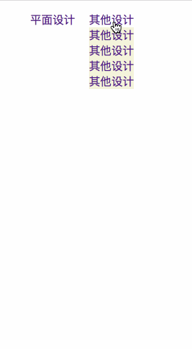

*  [目录](#0)
    *  [jquery控制CSS](#1)
    *  [jquery控制标签属性](#2)
    *  [jquery控制html标签内容](#3)
    *  [创建节点](#4)
    *  [插入节点](#5)
    *  [删除节点](#6)


<h1 id="1">jquery控制CSS</h1>

**css()**
~~~js
$('button').eq(0).click(function(e){})// eq取得jq对象中的第一个对象

$('div').css('width', '200px');//单个属性

$('div').css({'width':'200px', 'height', '300px'});//多个属性

$('div').css('width');//获取属性值
~~~

<h1 id="2">jquery控制标签属性</h1>

**attr()**
~~~js
$('div').attr('title', 'hello world')//修改div标签的title属性值

$('div').attr({'title':'hello world', 'class':'myclass'})//修改div标签的多个属性

$('div').attr('title') //获取title属性值
~~~


<h1 id="3">jquery控制html标签内容</h1>

- 设置HTML内容
```js
$('div').html('<p>我的家乡</p>很美丽');
```
- 获取HTML内容
```js
var content = $('div').html();
```

<h1 id="4">创建节点</h1>

```js
$('<div></div>') //创建元素节点

$('<div>发顺丰</div>') //创建文本节点

$('<div title="test">fsf</div>') //创建属性节点

$('div.box').append(testhtml); //添加创建的节点
```

<h1 id="5">插入节点</h1>
```js
append() //向匹配元素内部追加内容 $("p").append("<div>hello</div>")

appendTo() //$(A).append(B),将A追加到B中

prepend() //向匹配元素内部追加前置内容

prependTo() //$(A).prependTo(B),将A前置到B中

after() //在匹配元素之后插入内容

insertAfter() //$(A).insertAfter(B),将A插入到B后面

before() //在匹配元素之前插入内容

insertBefore() //$(A).insertBefore(B)，将A插入到B前面
```

<h1 id="6">删除节点</h1>

#### remove()
当某个节点用remove方法删除后，该节点所包含的所有后代节点将同时被删除，返回值是被删除的节点。


#### detach()


#### empty()


### jquery对角线动画
不加时间参数没有动画效果。
~~~js
$('img').hide(1000) //隐藏图片

$('img').show(1000) //显示图片

$('img').toggle(1000) //在隐藏和显示之间切换
~~~

### jquery滑动动画
不加时间参数也有动画效果。
```js
$('img').slideUp(1000); //向上滑动隐藏

$('img').slideDown(1000); //向下滑动显示

$('img').slideToggle(1000); //在隐藏和显示之间切换
```

### jquery排他性
```html
 <script type="text/javascript">

        $(function () {//jquery的入口函数
            $('li').click(function (e) {
                $(this).css('background', 'pink');
                $(this).siblings().css('background', '#fff');
            });
        })
    </script>
</head>
<body>
<ul>
    <li>fjojfojoj</li>
    <li>fsfsfsfe</li>
    <li>fsssfefew</li>
</ul>
</body>
```


### 动画案例



```html
<head>
    <meta charset="UTF-8">
    <title>Document</title>
    <script src="./jquery.js" charset="UTF-8"></script>
    <style type="text/css">
        .box{
            margin: 0 auto;
        }
        div>ul>li{
            float: left;
            text-decoration: none;
        }
        a{
            text-decoration: none;

        }

        li{
            list-style-type: none;
        }

        li ul{
            /*display: none;*/
            position: absolute;
        }

        #li02{
            margin-left: 20px;
        }

        #ul01,#ul02{
            padding-left: 0px;
            background-color: beige;
        }

    </style>
    <script type="text/javascript">

        $(function () {//jquery的入口函数
            $('.demo>li').hover(function () {
                $(this).children("ul").stop().slideToggle();
            });
        })
    </script>
</head>
<body>

 <div class="box">
     <ul class="demo">
         <li id="li01">
             <a href="#">平面设计</a>
             <ul id="ul01" style="display: none">
                 <li><a href="#">平面平面</a></li>
                 <li><a href="#">平面平面</a></li>
                 <li><a href="#">平面平面</a></li>
                 <li><a href="#">平面平面</a></li>
             </ul>
         </li>

         <li id="li02">
             <a href="#">其他设计</a>
             <ul id="ul02" style="display: none">
                 <li><a href="#">其他设计</a></li>
                 <li><a href="#">其他设计</a></li>
                 <li><a href="#">其他设计</a></li>
                 <li><a href="#">其他设计</a></li>
             </ul>
         </li>
     </ul>
 </div>

</body>
```


