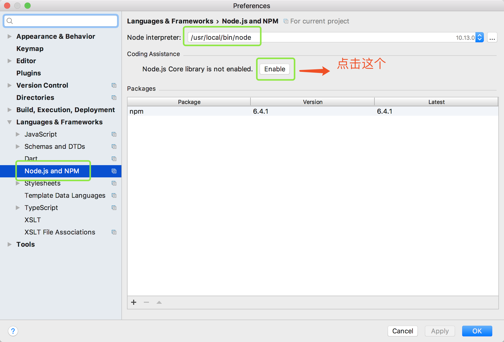

## WebStorm配置nodejs
1. 下载安装[nodejs](https://nodejs.org/en/)

2. 配置WebStorm

## [文件系统](http://nodejs.cn/api/fs.html#fs_fs_readfilesync_path_options)
1. 引入文件系统，在文件头添加如下代码

~~~javascript
const  fs = require('fs');
~~~

2. 同步读取文件内容

~~~javascript
// 未指定字符编码，则返回原始的 buffer
const  data = fs.readFileSync('./README.md');

//指定字符编码UTF-8,以字符串的方式返回文件内容
const  data = fs.readFileSync('./README.md', 'utf-8');
~~~

3. 异步读取文件内容

~~~javascript
fs.readFile('./README.md', function (err, data) {
    if (err)
        throw err;
    console.log(data);
});
~~~

## Buffer

~~~javascript
// 创建一个长度为 10、且用 0 填充的 Buffer。
const buf1 = Buffer.alloc(10);

// 创建一个长度为 10、且用 0x1 填充的 Buffer。 
const buf2 = Buffer.alloc(10, 1);

// 创建一个长度为 10、且未初始化的 Buffer。
// 这个方法比调用 Buffer.alloc() 更快，
// 但返回的 Buffer 实例可能包含旧数据，
// 因此需要使用 fill() 或 write() 重写。
const buf3 = Buffer.allocUnsafe(10);

// 创建一个包含 [0x1, 0x2, 0x3] 的 Buffer。
const buf4 = Buffer.from([1, 2, 3]);

// 创建一个包含 UTF-8 字节 [0x74, 0xc3, 0xa9, 0x73, 0x74] 的 Buffer。
const buf5 = Buffer.from('tést');

// 创建一个包含 Latin-1 字节 [0x74, 0xe9, 0x73, 0x74] 的 Buffer。
const buf6 = Buffer.from('tést', 'latin1');

const data5 = Buffer.from('hello');
console.log(data5);
console.log(data5.toString());
console.log(data5.toString('base64'));
console.log(data5.toString('utf-8'));
~~~

## HTTP

1. 引入HTTP模块
~~~javascript
const http = require('http')
~~~

2. 案例
~~~javascript
const  fs = require('fs');
const http = require('http');
const qs = require('querystring') //解析post过来的urlencoded数据

const hostname = '127.0.0.1';
const port = 3000;
const users = [{name:'张三', age:20},{name:'李四', age:22}];

const server = http.createServer(function(request, response){
    //获取用户请求的url和请求方法
    // const url = request.url;
    // const method = request.method;
    // const headers = request.headers;
    const {url, method, headers} = request; //ES6结构语法，等同于以上三行代码

    //响应一个get请求，返回内容是html
    if(url === '/' && method === 'GET')
    {
        //1. 设置响应头为纯文本
        // response.setHeader('Content-Type', 'text/plain');
        //给前台返回数据
        // response.end("hello");

        //2. 设置响应头为html
        fs.readFile('./index.html', (err, data) => {
            if (err)
                throw err;

            // response.setHeader('Content-Type', 'text/html');
            response.writeHead(200, {'Content-Type': 'text/html'});
            //给前台返回数据
            response.end(data);
        });
    }
    else if (url === '/users' && method === 'GET') {
        //3.设置响应头为json
        response.writeHead(200, {'Content-Type': 'application/json'});
        //给前台返回json数据
        response.end(JSON.stringify(users));
    }
    else if (url === '/users' && method === 'POST') {
        let body = [];
        let bodyStr = '';
        request.on('data', (chunk) => {
            body.push(chunk);
        }).on('end', () => {
            //Buffer.concat() 返回一个合并了 list 中所有 Buffer 实例的新建的 Buffer 。
            bodyStr = Buffer.concat(body).toString();
            //解析post过来的urlencoded数据
            const user = qs.parse(bodyStr);
            users.push(user);
            response.writeHead('200', {'Content-Type': 'text/plain'});
            response.end("ok");
        });
    }
});
server.listen(port);
~~~

对应的前端html代码
~~~html
<!DOCTYPE html>
<html lang="en">
<head>
    <meta charset="UTF-8">
    <title>node-demo</title>
</head>
<body>
    
Hello Word

    <li id="userList"></li>

    <form action="/users" method="post">
        <input type="text" name="name">
        <input type="number" name="age">
        <input type="submit" name="新增用户">
    </form>
</body>
</html>

~~~

