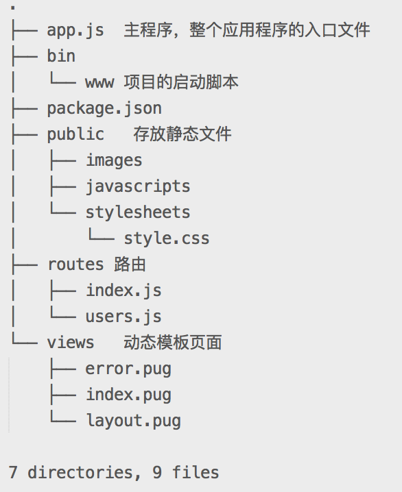

*  [目录](#0)
    *  [NODEJS的原生模块](#1)
    *  [自定义模块](#2)
    *  [NPM](#3)
    *  [Web开发框架Express](#4)
    

<h1 id="1">NODEJS的原生模块</h1>

- Http
- File System
- Querystring
- Url
- Buffer
- Crypto  加密
- Events  事件
- Net 网络操作
- OS  操作系统信息
- Path    处理文件路径
- Stream  流操作
- Timers  定时器
- ZLIB    压缩

<h1 id="2">自定义模块</h1>

#### 引入模块
- 引入node模块:require('fs');
- 引入自定义模块:require(reletivePath);
- 导入时可省略后缀名,模块可以是文件或目录,如果是目录则引入目录中index.js;

#### 模块内部开放接口需要使用exports
```javascript
exports.a = 12;
```

#### 引用自定义模块

>注意加./
>将自定义的模块放在node_modules文件夹下面,引入时不需要加./

```javascript
const com = require('./com');
console.log(com.a);//12
```

#### 批量输出接口
```javascript
module.exports = {
    a: 13,
    b: 23,
    c: 34
};

const com = require('./com');
console.log(com.a, com.b, com.c);
```
<h1 id="3">NPM</h1>

[NPM官网](https://www.npmjs.com/)

#### 1. NodeJS Package Manager(NodeJS包管理器)
    - 统一下载途径
    - 自动下载依赖

```
npm下载的模块都存放在node_modules文件下

npm install xxx
npm uninstall xxx

npm init
npm publish xxx
npm unpublish xxx
```


#### 2. **require**
    - 如果有"./"，从当前目录找；
    - 如果没有"./"，先从系统模块找，再从node_modules找，所以建议**自定义模块统一，都放到node_modules里面;**

#### 4. NPM的使用:安装第三方模块
>npm install moduleName

>全局安装:npm install -g moduleName

>开发依赖:npm install --save-dev moduleName 别名-D

>运行时依赖:npm install --save moduleName 别名-S 

>修改淘宝注册点:npm config set registryhttps://registry.npm.taobao.org/


#### 5. 引入第三方模块 
```javascript
    require('moduleName')
```

<h1 id="4">Web开发框架Express</h1>

[Express官网](http://www.expressjs.com.cn/)
#### 1-安装和使用:

- 安装:npm i -g express express-generator
>- -g表示全局安装;
>- express用来创建项目;
>- express-generator用来创建项目的脚手架;

- 如果mac:sudo npm i -g express express-generator 
>- 这里安装的express是命令而不是node的express模块;
>- 当安装的包是命令而非运行时依赖，通常需要全局安装;


#### 2-创建项目
- 1)express projectName --hbs 
>- projectName:项目名称;
>- --hbs指的模板引擎设置为handlebars;
- 2)cd projectName 
- 3)安装依赖:npm i 
- 4)启动项目:npm start

#### 3-服务器自动重启:
- nodemon
- node-dev
>- 安装node-dev: npm i -g node-dev
>- 配置package.json:

```
"scripts": {
    "start": "node-dev ./bin/www"
  },
```


#### 4-生成的项目结构


##### 1) 在bin/www文件中：
```javascript
默认3000端口的出处
var port = normalizePort(process.env.PORT || '3000');
app.set('port', port);

这里的app最后追溯到express.js文件的createApplication()方法，app就是函数function(req, res, next){}
var server = http.createServer(app);
```
##### 2) 在app.js中：
```javascript
1. app就是express构造函数的返回值
var app = express();

2. 路由处理
//导入路由相关模块
var indexRouter = require('./routes/index');
var usersRouter = require('./routes/users');

app.use('/', indexRouter);
app.use('/users', usersRouter);
```

##### 3) routes/index.js
当前端访问http://localhost:3000时，app.js里面的路由处理就会把访问根据路由导向indexRouter(即./routes/index)。
```javascript
var express = require('express');
var router = express.Router();

//这里就返回一个页面index.hds
//这里的/是http://localhost:3000/后面的/
//如果访问地址是http://localhost:3000/user/，app.js中配置路由为"/user"，而这里依然是"/",不过这个"/"是user后面的。
router.get('/', function(req, res, next) {
  res.render('index', { title: 'Express' });
});

module.exports = router;
```

为什么res.render中的index会表示views/index.hbs，因为在app.js中，视图引擎的目录设置为了"绝对路径/views"，所以会去找views下面的index.hbs。
```js
// 视图引擎设置，__dirname表示当前文件的绝对路径
app.set('views', path.join(__dirname, 'views'));
app.set('view engine', 'hbs');//也可以写html
```

#### 4) npm start
为什么使用npm start可以启动服务器？因为在package.json中,脚本最后运行的还是node ./bin/www"。
```js
"scripts": {
    "start": "node ./bin/www"
  },
```

#### 5) 自定义hbs文件
/views/my.hbs
~~~js
href为自定义的css文件，
<link rel="stylesheet" href="/stylesheets/api.css">

<h1>测试文字</h1>
~~~

#### 6) 设置静态目录
[文档](https://expressjs.com/zh-cn/starter/static-files.html)

6.1）
~~~javascript
app.use(express.static(path.join(__dirname, 'public')));
~~~

- 作用一，项目中使用"/"就表示根目录，也就是public；
- 作用二，前端可以访问public中的文件，因为3000后面的/就表示public；
~~~
http://localhost:3000/images/kitten.jpg
http://localhost:3000/css/style.css
~~~


6.2）要为 express.static 函数提供的文件创建虚拟路径前缀（路径并不实际存在于文件系统中），请为静态目录指定安装路径，如下所示：

~~~js
app.use('/static', express.static('public'));
~~~
现在，可以访问具有 /static 路径前缀的 public 目录中的文件。
~~~javascript
http://localhost:3000/static/images/kitten.jpg
http://localhost:3000/static/css/style.css
~~~

6.3) 要使用多个静态资源目录，请多次调用 express.static 中间件函数：
~~~js
app.use(express.static('public'));
app.use(express.static('files'));
~~~
Express 以您使用 express.static 中间件函数设置静态目录的顺序来查找文件。


