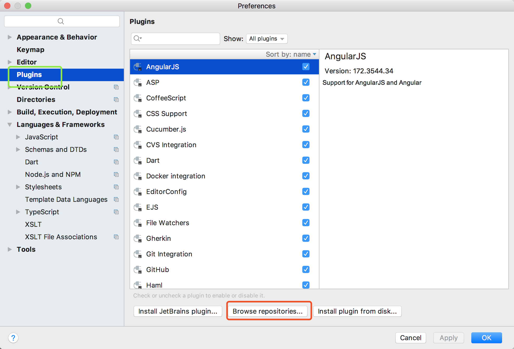

*  [目录](#0)
    *  [管理员页面](#1)
    *  [multer文件上传](#2)
    *  [数据校验](#3)
    *  [知识点](#4)
    
    


<h1 id="1">管理员页面</h1>

## 使用bootstrap

#### 1. 安装：npm i bootstrap@3
因为这个是给前端页面使用，所以安装完成后，将node_modules中bootstrap的下面的dist拷贝的public下面并将dist改名bootstrap。

#### 2. 安装bootstrap插件



#### 3. 使用bootstrap模板
command+J健，输入bs3- 


<h1 id="2">multer文件上传</h1>

## 1. muler是一个中间件
>muler是针对单个路由去使用，而不是注册在app.js中。

## 2. 安装：npm i multer -S

## 3. 基本用法：

```js
   const multer = require('multer');
   const upload = multer({
       dest: 'public/images'//上传的最终路径
   })
   router.post('/open-courses', upload.single('file'), async (req, res, next) => {
           // 上传的文件在这里
           req.file        
       });
```

## 4. 上传文件格式和大小约束

```js
   const upload = multer({
       dest: 'public/images',
       limits: {fileSize: 2 * 1024 * 1024},//最大2M
       fileFilter: function (req, file, cb) {
           console.log(file);
           // 判断文件是否合法，合法则处理，不合法则拒绝
           if (file.mimetype === 'image/gif' ||
               file.mimetype === 'image/jpeg' ||
               file.mimetype === 'image/png') {
               // 接收文件
               cb(null, true);
           } else {
               cb(new Error('请上传图片格式'), false);
           }
       }
   })
```

## 5. 自定义存储目录和文件名
要注销掉dest: 'public/images',

```js
   const storage = multer.diskStorage({
       destination: function (req, file, cb) { // 存储目录
           cb(null, 'public/images');
       },
       filename: function (req, file, cb) {//重命名 
           let extname = '';
           switch (file.mimetype) {
               case 'image/jpeg':
                   extname = '.jpg';
                   break;
               case 'image/png':
                   extname = '.png';
                   break;
               case 'image/gif':
                   extname = '.gif';
                   break;
           }
           cb(null, Date.now() + extname);
       }
   });
   const upload = multer({
       storage,
   });
```

<h1 id="3">数据校验</h1>

## 1. express-validator
npm i -S express-validator

## 2. 基本使用：

#### 定义校验函数

```js
const {body, validationResult} = require('express-validator/check');
const validateFn = [body('name').not().isEmpty().withMessage('公开课名称必填'),
    body('name').not().isEmpty().isAfter(new Date().toString()).withMessage
    ('截止日期必须晚于当前时间')];

router.post('/open-courses', 
    [upload.single('file'), ...validateFn], //同时执行多个中间件，用数组行驶
    async (req, res, next) => {
            //let errors = validationResult(req).formatWith(({msg}) => msg);
           let errors = validationResult(req);
            if(errors.isEmpty()){
                //没错误，校验通过

            }else{
                //校验失败
                //错误信息格式化
                errors = errors.formatWith((error) => error.msg);
            }
       });
``` 


#### 错误检测

```js
   let errors = validationResult(req);
   if(errors.isEmpty()){
       //没错误，校验通过
   }else{
       //校验失败
       //错误信息格式化
       errors = errors.formatWith((error) => error.msg);
   }
```


<h1 id="4">知识点</h1>
### sql语句生成

```
const mysql = require('mysql');
sql = mysql.format(`INSERT INTO open_course SET ?`, req.body);
```


### 数组结构

```
const validations = [b,c,d]
const middlewares = [a, ...validations]  // [a,b,c,d]
```


### 函数形参结构

```
// formatWith形参形如：{msg:'',value:'',....}
errors.formatWith(({msg}) => msg)
```


