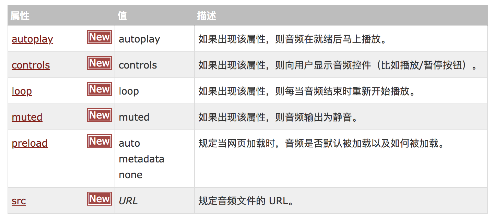
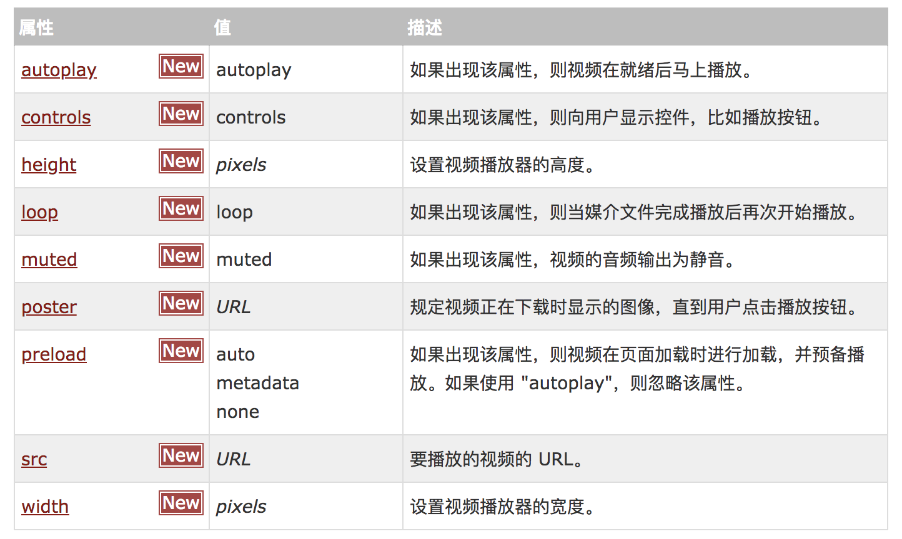

## 一、H5新标签的兼容问题

H5的新标签在谷歌等浏览器是可以支持的，但是IE不支持。为了兼容IE浏览器，有两种解决方式。

### 解决方法一：
在该标签的CSS中设置该标签display: block;然后通过DOM的方式创建这个标签document.createElement("header");

```javascript
<style type="text/css">
        header{
            width: 100%;
            height: 100px;
            background-color: red;
            font-size: 50px;
            text-align: center;
            display: block;
        }
    </style>
    <script type="text/javascript">
        document.createElement("header");
    </script>
```

### 解决方法二：
引入外部的html5shiv.js文件，
`<script src="html5shiv.js"></script>`

但是谷歌浏览器是支持的，所以加入html5shiv.js文件是多余的。所以加入以下代码，如果是IE8就请求这个文件，如果是其他的就不请求这个文件。
cc:ie6 + tab键 

```html
</head>
    <!--如果浏览器小于IE8就执行里面的代码，并且该命令只针对IE浏览器-->
    <!--[if lte IE 8]>
        <script src="html5shiv.js"></script>
    <![endif]-->
<body>
```

## 二、H5中的多媒体标签

### 1、音频标签
谷歌浏览器不支持autoplay属性；

```html
<audio src="火影.mp3" controls autoplay loop></audio>
```

audio标签的属性：


### 2、视频标签
谷歌浏览器不支持autoplay属性，但是加上muted属性后可以自动播放，但是视频是静音的；

```html 
<video src="火影.mp3" muted controls autoplay loop></video>
```

video标签的属性：


### 3、多媒体格式兼容问题

以视频格式为例，如果浏览器A支持第一个格式，那就直接播放第一个视频，如果浏览器B支持第二个格式，遇到第一个格式就不会执行，遇到第二个可以支持的，那么才播放。

```html
    <video>
        <source src="trailer.mp4">
        <source src="trailer.ogg">
        <source src="trailer.WebM">
    </video>
```


## 三、新表单元素及属性

### 1、智能表单控件

```html
 
<input  type="email">
 email: 输入合法的邮箱地址
 url：  输入合法的网址
 number： 只能输入数字
 range： 滑块
 color： 拾色器
 date： 显示日期
 month： 显示月份
 week ： 显示第几周
 time：  显示时间
```
### 2、智能表单控件的属性

```html
 ◆form属性：   
    autocomplete=on | off          是否显示提示
    novalidate=true | false        是否关闭校验

 ◆ input属性：
    autofocus   可以自动的获取焦点
    placeholder="请输入邮件"  可以设置文本框的提示信息
    required  表单元素必须有内容才能提交

 ◆ 有一个表单元素，不想在form中写，但是想跟着form提交，那么在该表单元素中填写form属性，值位表单的ID值；
    <form action="" method="get" id="fm">
        <input type="text" name="em" autofocus placeholder="请输入邮件" required><br/>
        <input type="submit">
    </form>
    <input type="text" value="" name="name" form="fm">

 ◆ datalist：
    <form action="" method="get" id="fm">
        <input type="text" name="em" list="url_list"><br/>

        <datalist id="url_list">
            <option value="http://www.baidu.com">百度</option>
            <option value="http://www.google.com">谷歌</option>
        </datalist>
    </form>

```

## 三、HTMl5中的API

### 1、获取页面元素的三种方式

```javascript
  ☞ document.querySelector("选择器")；
     备注：
        选择器： 可以是css中的任意一种选择器
         通过该选择器只能选中第一个元素。

  ☞ document.querySelectorAll("选择器");
       备注：
          与document.querySelector区别： querySelectorAll 可以选中所有符合选择器规则的元素，返回的是一个列表。querySelector返回的只是单独的一个元素

  ☞ document.getElementsByClassName('类样式的名字');

```   

### 2、classList

```javascript
  ☞ Dom.classList.add("类名"): 给当前dom元素添加类样式
  ☞ Dom.classList.remove("类名"); 给当前dom元素移除类样式
  ☞ Dom.classList.contains("类名"); 检测是否包含类样式
  ☞ Dom.classList.toggle("active");  切换类样式（有就删除，没有就添加）
```

案例：
```html
<!DOCTYPE html>
<html>
<head>
    <title>demo</title>
</head>
    <style type="text/css">
        .test{
            width: 300px;
            height: 300px;
            background-color: #ff0000;
        }
    </style>
<body>
    <input type="button" value="添加" id="btn1" />
    <input type="button" value="删除" id="btn2" />
    <input type="button" value="切换" id="btn3" />
    <input type="button" value="包含" id="btn4" />

    <div id="dv" class="cla"></div>
</body>
<script type="text/javascript">
        
        function my$(input_id)
        {
            return document.getElementById(input_id);
        }

        my$("btn1").onclick = function(){
            my$("dv").classList.add("test");
        };

        my$("btn2").onclick = function(){
            my$("dv").classList.remove("test");
        };

        my$("btn3").onclick = function(){
            my$("dv").classList.toggle("test");
        };

        my$("btn4").onclick = function(){
            var resu = my$("dv").classList.contains("test");
            console.log(""+resu);
        };
    </script>
</html>
```


### 3、自定义属性

```html
<body>
<!-- 自定义的属性 -->
<div id="dv" data-name="Jim" data-age="20" data-user-sex="男"></div>

<script type="text/javascript">
    var dt = document.querySelector("#dv").dataset;
    console.log(dt.name);//Jim
    console.log(dt["age"]);//20
    console.log(dt.userSex);//男

    //通过代码为标签添加自定义属性
    dt.height = 180;
    dt.userWeight = 200;
</script>
</body>
```

## 四、文件读取

```html
  ☞  FileReader
      FileReader             接口有3个用来读取文件方法返回结果在result中
      readAsBinaryString    ---将文件读取为二进制编码
      readAsText           ---将文件读取为文本
      readAsDataURL        ---将文件读取为DataURL

 ☞  FileReader 提供的事件模型
     onabort        中断时触发
     onerror        出错时触发
     onload     文件读取成功完成时触发
     onloadend  读取完成触发，无论成功或失败
     onloadstart    读取开始时触发
     onprogress 读取中

```
code:
```html
<body>
    <input type="file" id="f1">
    <input type="file" id="f2">
    <div></div>
<script type="text/javascript">
    var f1 = document.querySelector("#f1");
    f1.onchange = function () {
        //上传的文件
        var file1 = this.files[0];
        var fReader = new FileReader();
        //读取文件
        fReader.readAsText(file1);
        //读取文件加载完成
        fReader.onload = function () {
            //读取的结果
            var result = fReader.result;
            var style = document.createElement("style");
            style.innerHTML = result;
            document.querySelector("head").appendChild(style);
        };
    };

    var f2 = document.querySelector("#f2");
    f2.onchange = function () {
      var file2 = this.files[0];
      var fReader = new FileReader();
      fReader.readAsText(file2);
      fReader.onload = function () {
          //读取的结果
          var result = fReader.result;
          var script = document.createElement("script");
          script.innerHTML = result;
          document.querySelector("head").appendChild(script);
      };
    };
</script>
</body>

<!-- 其中上传文件test.css和test.js -->
div{
  width: 200px;
  height: 100px;
  background-color: red;
}

document.querySelector('div').onclick=function () {
    this.style.backgroundColor='yellow';  
};
```

## 五、获取网络状态
```javascript
  ☞ 获取当前网络状态
         window.navigator.onLine //返回一个布尔值

  ☞ 网络状态事件
         1. window.ononline
         2. window.onoffline
```
 
## 六、获取地理定位

不推荐使用，需要翻墙。
```javascript
  ☞  获取一次当前位置
      window.navigator.geolocation.getCurrentPosition(successCallback,errorCallback);

       1. coords.latitude   维度
       2. coords.longitude   经度

  ☞  实时获取当前位置
      window.navigator.geolocation.watchPosition(successCallback,errorCallback);

  ☞ 分析地理定位小案例
```

## 七、本地存储

```javascript
   ☞发展：
      随着互联网的快速发展，基于网页的应用越来越普遍，同时也变的越来越复杂，为了满足各种各样的需求，会经常性在本地存储大量的数据，传统方式我们以document.cookie来进行存储的，但是由于其存储大小只有4k左右，并且解析也相当的复杂，给开发带来诸多不便，HTML5规范则提出解决方案，使用sessionStorage和localStorage存储数据。 

    ☞  localStorage：
        1. 永久生效
        2. 多窗口共享
        3. 容量大约为20M
        
        ◆window.localStorage.setItem(key,value)  设置存储内容
        ◆window.localStorage.getItem(key)        获取内容
        ◆window.localStorage.removeItem(key)     删除内容
        ◆window.localStorage.clear()            清空内容
        
    ☞ sessionStorage：
          1. 生命周期为关闭当前浏览器窗口
           2. 可以在同一个窗口下访问
           3. 数据大小为5M左右
           
         ◆window.sessionStorage.setItem(key,value)
        ◆window.sessionStorage.getItem(key)
        ◆window.sessionStorage.removeItem(key)
        ◆window.sessionStorage.clear()
```

