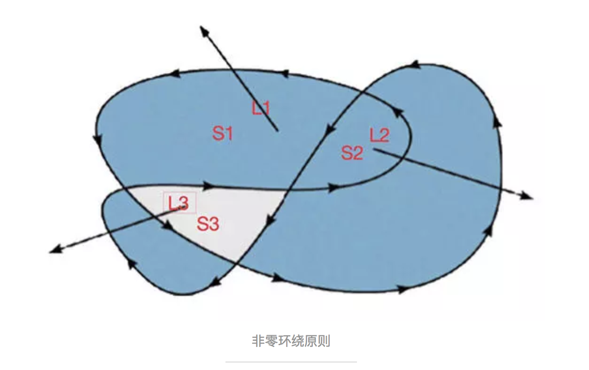

## Canvas画布

### 绘图工具
  ☞ 设置画布大小： canvas标签，***宽和高不能通过css来设置，宽和高不能有px;***

  ☞ 解决画布重绘问题:
       1. 设置一次描边;
       2. 开启新的图层.


### 绘图方法

```javascript
var ctx = canvas.getContext("2d"); 获取画图工具
ctx.moveTo(x,y)    落笔
ctx.lineTo(x,y)    连线
ctx.stroke()       开始画线
ctx.beginPath()；   开启新的图层，重置之前的属性
ctx.strokeStyle = "red";  线的颜色
ctx.lineWidth = 5;  线的宽度

线连接方式：ctx.lineJoin=round | bevel | miter (默认)

线帽（线两端的结束方式）：lineCap: butt(默认值) | round | square 

闭合路径： ctx.closePath()
```

### 渐变方案

```
  ☞ 线性渐变
     var grd=ctx.createLinearGradient(x0,y0,x1,y1);
          x0-->渐变开始的x坐标
          y0-->渐变开始的y坐标
          x1-->渐变结束的x坐标
          y1-->渐变结束的y坐标
          
      grd.addColorStop(0,"black");      设置渐变的开始颜色
      grd.addColorStop(0.1,"yellow");   设置渐变的中间颜色
      grd.addColorStop(1,"red");        设置渐变的结束颜色

      ctx.strokeStyle=grd;
      ctx.stroke();
      
      备注：
         addColorStop(offse,color);
         中渐变的开始位置和结束位置介于0-1之间，0代表开始，1代表结束。中间可以设置任何小数
         
  ☞ 径向渐变
  
            ctx.createradialGradient(x0,y0,r0,x1,y1,r1);

            (x0,y0)：渐变的开始圆的 x,y 坐标

            r0：开始圆的半径

            (x1,y1)：渐变的结束圆的 x,y 坐标

            r1：结束圆的半径
```

### 填充效果

```
  ctx.fill();         设置填充效果
  ctx.fillstyle="值"; 设置填充颜色
```

### 非零环绕原则

      首先，我们得给图形确定一条路径，只要“一笔画”并且“不走重复路线”就可以了。如图，标出的是其中的一种路径方向。我们先假定路径的正方向为1（其实为-1啥的也都可以，正负方向互为相反数，不是0就行），那么反方向就是其相反数-1。

      然后，我们在子路径切割的几块区域内的任意一点各取一条方向任意的射线，这里我只取了三个区域的射线为例，来判断这三块区域是“里面”还是“外面”。

      接下来，我们就来判断了。S1中引出的射线L1，与S1的子路径的正方向相交，那么我们就给计数器+1，结果为+1，在外面。

      S2中引出的射线L2，与两条子路径的正方向相交，计数器+2，结果为+2，在外面。

      S3中引出的射线L3，与两条子路径相交，但是其中有一条的反方向，计数器+1-1，结果为0，在里面。没错，只要结果不为0，该射线所在的区域就在外面。




```
 ☞ 绘制一个如下图形
```


### 绘制虚线

```js
    原理：

     设置虚线其实就是设置实线与空白部分直接的距离,利用数组描述其中的关系

     例如： [10,10]  实线部分10px 空白部分10px

     例如： [10,5]  实线部分10px 空白部分5px

     例如： [10,5,20]  实线部分10px  空白5px  实线20px  空白部分10px 实线5px 空白20px....

    绘制：
     ctx.setLineDash(数组);
     ctx.stroke();
     
     例如：
         ctx.moveTo(100, 100);
         ctx.lineTo(300, 100);
         ctx.setLineDash([2,4]);
         ctx.stroke();

    注意：
        如果要将虚线改为实线，只要将数组改为空数组即可。
```

### 绘制矩形和动画效果

```
   ☞ 绘制一个描边矩形： content.strokeRect(x,y,width,height) 
   ☞ 绘制一个填充矩形： content.fillRect(x,y,width,height)  
   ☞ 清除：           content.clearRect(x,y,width,height)  
   
   
   ☞ 实现动画效果： 
          1. 先清屏
          2. 绘制图形
          3. 处理变量
```

### 绘制文本

```
  ☞ 绘制填充文本
      content.fillText(文本的内容,x,y)
  
  ☞ 绘制镂空文本
       content.strokeText(文本的内容,x,y);
       
  ☞ 设置文字大小：
       content.font="20px 微软雅黑"
       备注： 该属性设置文字大小，必须按照cssfont属性的方式设置
       
  ☞ 文字水平对齐方式【文字在圆心点位置的对齐方式】
        content.textalign="left | right | center"
  
  ☞文字垂直对齐方式
         content.textBaseline="top | middle | bottom | alphabetic(默认)"
  
  ☞文字阴影效果
         ctx.shadowColor="red";  设置文字阴影的颜色
         ctx.ShadowOffsetX=值;   设置文字阴影的水平偏移量
         ctx.shadowOffsetY=值;   设置文字阴影的垂直偏移量
         ctx.shadowBlur=值;      设置文字阴影的模糊度
```

### 绘制图片

```
  ☞    
      //将图片绘制到画布的指定位置
     content.drawImage(图片对象,x,y);

  ☞ 
     //将图片绘制到指定区域大小的位置  x,y指的是矩形区域的位置，width和height指的是矩形区域的大小
     content.drawImage(图片对象,x,y,width,height);
     
  ☞ 
     //将图片的指定区域绘制到指定矩形区域内
     content.drawImage(图片对象,sx,sy,swidth,sheight,dx,dy,dwidth,dheight);
     
     sx,sy 指的是要从图片哪块区域开始绘制，swidth，sheight 是值 截取图片区域的大小
     dx,dy 是指矩形区域的位置，dwidth,dheight是值矩形区域的大小
     
   ☞ 
      解决图片绘制到某一个区域的按原比例缩放绘制：
        绘制宽：绘制高==原始宽：原始高
```

### 绘制圆弧

```
   ☞
     content.arc(x,y,radius,startradian,endradian[,direct]);
            x,y    圆心的坐标
             radius 半径
             startradian   开始弧度
             endradian     结束弧度
             direct        方向（默认顺时针 false）   true 代表逆时针
             
   ☞ 0度角在哪？
          以圆心为中心向右为0角 顺时针为正，逆时针为负
             
    ☞ 绘制圆上任意点：  
        公式：
           x=ox+r*cos( 弧度 )
           y=oy+r*sin( 弧度 )

         ox: 圆心的横坐标
         oy: 圆心的纵坐标
         r： 圆的半径
```

### 平移【坐标系圆点的平移】

```
ctx.translate(x,y);

   特点：
      通过该方法可以将原点的位置进行重新设置。

   注意：
       1. translate(x,y) 中不能设置一个值

       2. 与moveTo(x,y) 的区别：

            moveTo(x,y) 指的是将画笔的落笔点的位置改变，而坐标系中的原点位置并没有发生改变；
            translate(x,y) 是将坐标系中的原点位置发生改变；
```

### 旋转【坐标系旋转】

```
ctx.rotate(弧度)  已画布的坐标原点为基准去旋转。
```

### 伸缩

```
 ctx.scale(x,y)

   备注：
       沿着x轴和y轴缩放

       x,y 为倍数  例如： 0.5  1
```

