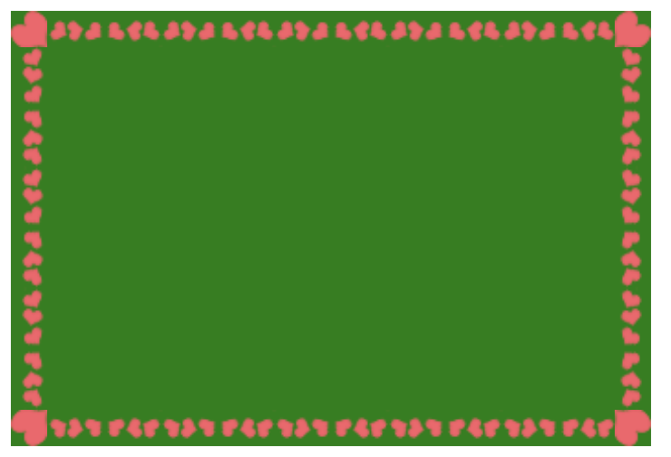

###背景显示位置

```css
div{
      width: 300px;
      height: 200px;
      background-color: green;
      border: 20px dashed red;
      /*设置背景图片*/
      background: url("2.jpg") no-repeat;
      color: blue;
      padding: 20px;
      /*设置图片从哪开始显示*/
      /*background-origin: border-box;!*图片从边框左上角显示*!*/
      /*background-origin: padding-box;!*图片从内边距的位置显示*!*/
      /*background-origin: content-box;!*图片从内容的位置开始显示*!*/

      /*设置图片在哪显示*/
      /*background-clip: border-box;*/
      /*background-clip: padding-box;!*在padding内部显示*!*/
      /*background-clip: content-box;!*文本内容区域显示这个图片*!*/

      /*设置背景按照比例缩放完整的显示*/
      /*background-size: contain;*/
      /*设置背景按照自己的缩放比例铺满,不确定是否完整显示*/
      background-size: cover;

    }
```

###边框圆角及阴影
```css
 div{
      width: 300px;
      height: 200px;
      background-color: green;
      /*设置四个角的角度*/
      /*border-radius: 10px;*/
      border-radius: 10px 20px;/*左上和右下是10px,右上和左下是20px*/

      /*水平,垂直，模糊度,阴影的颜色 ,inset是内部阴影*/
      /*box-shadow: 10px 20px 5px blue inset;*/
      box-shadow: 20px 20px 5px blue;
    }
```

###边框上加图片

```css
div{
      width: 313px;
      height: 200px;
      border: 20px solid red;
      background-color: green;
      /*选择图片作为边框的背景*/
      border-image-source: url("border_image_5.png");
      /*切割图片*/
      border-image-slice: 19;
      border-image-repeat:round ;/*stretch:拉伸,repeat平铺,推荐使用round,铺满*/
    }
```
如图：



###文本修饰
```css
div{
      width: 400px;
      height: 200px;
      border: 3px solid blue;
      text-align: center;
      padding-top: 50px;
      font-size: 30px;
      font-family: 全新硬笔行书简;
      /*水平,垂直,模糊度,阴影的颜色*/
      text-shadow: 5px 5px 5px red;
      /*text-shadow: 5px 5px 5px red,5px 5px 5px green; 不推荐使用*/
    }
```

###属性选择器

```html
<head>
  <meta charset="UTF-8">
  <title>title</title>
  <style>
    div{
      width: 300px;
      height: 200px;
      border: 3px solid red;
    }
    /*p后面所有的ul*/
    /*p~ul{*/
      /*background-color: green;*/
    /*}*/

    /*具有href属性,并且属性值是以E开头*/
    a[href^="e"]{
      background-color: green;
    }

    /*具有href属性,并且值是以mp4结尾的*/
    /*a[href$="mp4"]{*/
      /*background-color: green;*/
    /*}*/

/*具有href属性,并且值是包含l字符*/
    /*a[href*="l"]{*/
      /*background-color: green;*/
    /*}*/
  </style>
</head>
<body>
<div class="cls">
  <ul>
    <li><a href="Paneama.mp3">Panama.mp3</a></li>
    <li><a href="That Girl.mp3">That Girl.mp3</a></li>
    <li><a href="风的季节.mp3">风的季节.mp3</a></li>
    <li><a href="Es Rappelt Im Karton.mp3">Es Rappelt Im Karton.mp3</a></li>
    <li><a href="HandClap.mp4">HandClap.mp4</a></li>
  </ul>
</div>
</body>
```

###其他选择器
```html
<head>
  <meta charset="UTF-8">
  <title>title</title>
  <style>
    /*目标选择器,找锚点的p*/
    p:target{
      background-color: green;
    }

    /*选中后背景颜色改变*/
    p::selection{
      background-color: yellow;
    }

    div{
      width: 200px;
      height: 150px;
      border: 3px solid red;
    }
    /*设置第一个文字的*/
    div:first-letter{
      font-size: 30px;
    }

    /*设置第一行的文字样式*/
    div:first-line{
      background-color: yellow;
    }
  </style>
</head>
<body>
<p>床前明月光,疑似地上霜，举头望明月，低头思故乡</p>
<p>床前明月光,疑似地上霜，举头望明月，低头思故乡</p>
<p>床前明月光,疑似地上霜，举头望明月，低头思故乡</p>
<p id="four">床前明月光,疑似地上霜，举头望明月，低头思故乡</p>
<p>床前明月光,疑似地上霜，举头望明月，低头思故乡</p>
<a href="#four">找第四个p标签</a>

<div>
  李白,字太白,号青莲居士,又号,什么仙人,唐代的浪漫主义诗人
</div>
</body>
```

###结构伪类选择器
```html
<head>
  <meta charset="UTF-8">
  <title>title</title>
  <style>
    ul{
      cursor: pointer;
      list-style-type: none;
    }
    li{
      border: 1px solid red;
      width: 500px;
    }

    /*所有的li中第一个*/
    /*li:first-child{*/
      /*background-color: green;*/
    /*}*/

    /*!*所有的li中最后一个*!*/
    /*li:last-child{*/
      /*background-color: yellow;*/
    /*}*/

    /*!*前面第三个li样式改变*!*/
    /*li:nth-child(3){*/
      /*background-color: blue;*/
    /*}*/

    /*!*后面的第5个*!*/
    /*li:nth-last-child(5){*/
      /*background-color: orangered;*/
    /*}*/

    /*奇数和偶数的形式*/
    li:nth-child(odd){
      background-color: deeppink;
    }
    li:nth-child(even){
      background-color: green;
    }
  </style>
</head>
<body>
<ul>
  <li>1</li>
  <li>2</li>
  <li>3</li>
  <li>4</li>
  <li>5</li>
  <li>6</li>
  <li>7</li>
  <li>8</li>
  <li>9</li>
  <li>10</li>
</ul>
</body>
```

###线性渐变和径向渐变

```html
<head>
  <meta charset="UTF-8">
  <title>title</title>
  <style>
    .dv{
      width: 800px;
      height: 200px;
      border: 1px solid red;
    }
    p{
      width: 600px;
      height: 100px;
      border: 1px solid green;
      margin-left: 20px;
      /*方向,开始渐变颜色,结束的渐变颜色*/
      /*background-image: linear-gradient(to right,yellow,green);*/
      /*0deg从向向上渐变,90deg从左向右渐变*/
      /*background-image: linear-gradient(90deg,yellow,green);*/

      /*background-image: linear-gradient(*/
          /*to right,*/
      /*yellow 50%,*/
      /*green*/
      /*);*/

      background-image: linear-gradient(
         135deg,
          red 20%,
      green 20%,
      green 40%,
      red 40%,
      red 80%,
      green 80%
      );
    }

    /*径向渐变*/
    .cls{
      width: 300px;
      height: 300px;
      border: 1px solid red;
      margin: 0 auto;
      /*半径及开始的位置,开始的渐变颜色,结束的渐变颜色*/
      /*background-image: radial-gradient(100px at center,red,green);*/

      /*background-image: radial-gradient(100px at 10px 150px,red,green);*/
      
      background-image: radial-gradient(300px at 150px 150px,yellow 5%,green 5%,green 10%,blue 10%,blue 15%,red 15%,pink 20%);
    }
  </style>
</head>
<body>
<!--线性渐变-->
<div class="dv">
  <p></p>
</div>
<!--演示径向渐变-->
<div class="cls"></div>
</body>
```

###2D转换

```html
<head>
  <meta charset="UTF-8">
  <title>title</title>
  <style>
    .box{
      width: 600px;
      height: 500px;
      background-color: pink;
      margin: 0 auto;
    }
    .cls{
      width: 200px;
      height: 200px;
      background-color: green;
      margin: 0 auto;
      font-size: 100px;
      font-family: 全新硬笔行书简;
      text-align: center;
    }
    .box:hover .cls{
      /*横坐标发生位移,相对于原来的位置*/
      /*transform: translate(100px);*/
      /*横纵坐标位移*/
      /*transform: translate(100px,100px);*/

      /*旋转*/
      /*transform: rotate(60deg);*/

      /*!*缩小和放大,宽度为原来的0.2,高度为原来的2倍*!*/
      /*transform: scale(0.2,2);*/

      /*沿着x轴的方向倾斜了30度,沿着y轴方向也倾斜了30度*/
      transform: skew(30deg,30deg);
    }
  </style>
</head>
<body>
<div class="box">
  <div class="cls">帅</div>
</div>
</body>
```
###3D转换

```html
<head>
  <meta charset="UTF-8">
  <title>title</title>
  <style>
    .box{
      width: 600px;
      height: 500px;
      background-color: pink;
      margin: 0 auto;
      perspective: 1000px;/*透视效果*/
    }
    .cls{
      width: 100px;
      height: 100px;
      background-color: green;
      margin: 0 auto;
      font-size: 100px;
      font-family: 全新硬笔行书简;
      text-align: center;
      transform-style:preserve-3d;
    }
    .box:hover .cls{

      /*transform:  translateX(100px);!*沿着x轴位移*!*/
      /*transform:  translateY(100px);!*沿着y轴位移*!*/
      /*transform:  translateZ(100px);!*沿着z轴位移*!*/
      /*transform: rotateX(30deg);!*沿着x轴旋转*!*/
      /*transform: rotateY(30deg);!*沿着y轴旋转*!*/
      /*transform: rotateZ(30deg);!*沿着z轴旋转*!*/
      /*transform: scaleX(2);*/
      /*transform: scaleY(2);*/
      /*transform: scaleZ(3);*/
      /*transform: skewX(30deg);*//*倾斜*/
      /*transform: skewY(30deg);*/
    }
  </style>
</head>
<body>
<div class="box">
  <div class="cls">帅</div>
</div>
</body>
```

###过渡(补间动画)

```html
.box{
      width: 200px;
      height: 200px;
      background-color: red;
      /*写了什么属性,就是对应的这个属性有这种过渡的效果*/
      transition-property: all;/*所有的属性*/
      transition-delay: 1s;/*延时的秒数*/
      transition-duration: 2s;/*过渡的秒数*/
      transition-timing-function: linear;

    }
    .box:hover{
      width: 300px;
      height: 300px;
      background-color: green;
    }
```

###动画

[动画属性](https://www.w3cschool.cn/cssref/pr-animation.html)
```css
.box{
      width: 0;
      height: 0;
      /*四个边框*/
      border-left: 100px dashed red;
      border-top: 100px dashed green;
      border-right: 100px dashed blue;
      border-bottom: 100px dashed orange;
      border-radius: 50%;

      /*使用动画集的名字*/
      animation-name:rotate ;
      animation-duration: 2s;/*秒数*/
      animation-iteration-count: 1;/*设置动画执行的次数*/
      animation-timing-function: linear;/*匀速,设置速度的*/
      animation-direction: alternate;/*动画逆播*/
      animation-delay: 1s;/*延时*/
      animation-fill-mode: forwards;/*动画结束了,但是不能是无限次*/

    }
    .box:hover{
      animation-play-state: paused;/*鼠标进入就停止了*/
    }

    /*定义一个动画集*/
    /*@keyframes 动画集名字*/
    @keyframes rotate {
      from{
        transform: rotateZ(0deg);
      }
      to{
        transform: rotateZ(360deg);
      }
    }


    /*@keyframes rotate {
      0%{
      }

      20%{
      
      100%{
      }*/
    }
```

###伸缩布局
```html
<head>
  <meta charset="UTF-8">
  <title>title</title>
  <style>
    .box{
      width: 400px;
      height: 400px;
      border: 1px solid red;
      /*先把父元素设置为flex(伸缩的效果)*/
      display: flex;
      /*子元素在主轴方向的对齐方式的设置*/
      /*justify-content: flex-start;!*默认从左向右*!*/
      /*justify-content: flex-end;!*从右向左*!*/
      /*justify-content: center;!*中间显示*!*/
      /*justify-content: space-between;!*两端对齐的方式*!*/
      /*justify-content: space-around;!*两边空白,环绕对齐*!*/

      /*主轴的方向作为调整*/
      /*flex-direction: row;!*主轴水平*!*/
      /*flex-direction: row-reverse;!*主轴水平反转*!*/
      /*flex-direction: column;!*主轴水平方向变成了垂直的方向,侧轴永远都是垂直主轴的*!*/
      /*flex-direction: column-reverse;!*主轴竖着反转了*!*/

      /*侧轴对齐*/
      /*align-items: flex-start;!*侧轴开始*!*/
      /*align-items: flex-end;!*侧轴开始*!*/
      /*align-items: center;*/
      align-items: stretch;/*拉伸的效果展示,要想有效果,必须干掉子元素的高度*/

      /*默认子元素没有换行*/
      flex-wrap: wrap;/*子元素换行*/
      /*flex-wrap: nowrap;!*默认值*!*/
      /*flex-wrap: wrap-reverse;!*反转加换行*!*/

      align-content: flex-start;/*子元素换行后有空白行,希望没有空白行,需要重新设置主轴的方向*/

    }
    .dv1{
      width: 100px;
      height: 100px;
      background-color: red;
      margin-left: 5px;

    }
    .dv2{
      width: 100px;
      height: 100px;
      background-color: green;
      margin-left: 5px;
    }
    .dv3{
      width: 100px;
      height: 100px;
      background-color: blue;
      margin-left: 5px;
    }
  </style>
</head>
<body>
<div class="box">
  <div class="dv1"></div>
  <div class="dv2"></div>
  <div class="dv3"></div>
  <div class="dv3"></div>
  <div class="dv3"></div>
  <div class="dv3"></div>
</div>
</body>
```

###伸缩的百分比
```html
<head>
  <meta charset="UTF-8">
  <title>title</title>
  <style>
    .box{
      width: 400px;
      height: 400px;
      border: 1px solid red;
      display: flex;/*设置为伸缩的父元素*/
    }
    .dv1{
      width: 100px;
      height: 100px;
      background-color: red;
      flex: 2;
    }
    .dv2{
      width: 100px;
      height: 100px;
      background-color: green;
      flex: 2;
    }
    .dv3{
      width: 100px;
      height: 100px;
      background-color: yellow;
      flex: 1;
    }
  </style>
</head>
<body>
<div class="box">
  <div class="dv1"></div>
  <div class="dv2"></div>
  <div class="dv3"></div>
</div>
</body>
```

